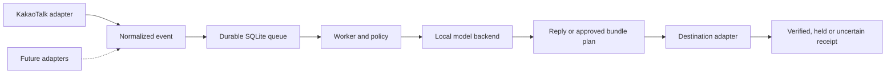

# Communication Hub

[English](README.md) | [한국어](README_ko.md)

A local Rust service for routing communication and work requests through one hub. **KakaoTalk is the first implemented adapter. Discord, Slack, and Notion are planned, not connected.** Notion is treated as a document/comment workspace rather than another chat window.

**Status: experimental alpha.** Text delivery has been exercised on a real macOS installation; automated native attachment upload still needs end-to-end validation. Automation is disabled in fresh installations.



## What it does

- Separates sessions and event IDs by **provider, account, and conversation**.
- Persists incoming work before model execution; ingestion can continue while the worker waits.
- Journals delivery attempts and quarantines uncertain work after restart. It does not promise exactly-once delivery across an external UI.
- Reloads the configured Contact-Other policy before each model invocation and external write.
- Uses a compatible local Codex App Server over WebSocket/JSON-RPC on a Unix socket. Model and reasoning effort are configurable.
- Provides `status`, `adapters`, `pause`, and `resume` through a same-user local control socket. Pause survives restart.
- Builds approved JSON + ZIP bundles with path, size, CRC, and basic sensitive-content checks.
- Uses Swift helpers for macOS permissions and Accessibility. The runtime requires neither Python nor Orca.

The current worker is serial. This is an adapter foundation, not a ready-made universal integration or dynamic plugin loader.

## macOS setup

Requirements: Rust/Cargo, Xcode Command Line Tools (`swiftc`), `jq`, logged-in KakaoTalk, and a compatible running Codex App Server with a model your account supports. Rust unit tests also run on Linux; the KakaoTalk helpers are macOS-only.

```sh
git clone https://github.com/FMsongX2/communication-hub.git
cd communication-hub
./scripts/setup-macos.sh --model YOUR_SUPPORTED_MODEL_ID
```

The script builds the Rust binary and two locally signed helper apps. It creates a private configuration under `~/Library/Application Support/CommunicationHub` and refuses to overwrite an existing configuration. **It does not start a service, enable an adapter, send a message, or grant macOS permissions.**

1. Review the generated `config.json` and `contact-other.md`. Set the backend socket, account alias, supported model, and an existing approved project working directory.
2. Grant **Full Disk Access to Kakao Mention Receiver** and **Accessibility to Kakao Reply Sender** in macOS settings. These are broad OS grants even though the helpers limit their operations to KakaoTalk.
3. Set `kakao.enabled=true`. Enable `dispatch_enabled` and `external_auto_send` only after reviewing policy and recipients. Both start as `false`.
4. Run the hub in the foreground first:

```sh
"$HOME/Library/Application Support/CommunicationHub/bin/communication-hub" run
```

See [operations](docs/operations.md) for a user LaunchAgent, upgrades, and rollback. The hub belongs in the logged-in user's session, not a root system daemon. A compatible local backend can be a desktop-managed server or a user-started App Server; this repository does not extract credentials or create backend accounts.

## CLI and calls

```sh
communication-hub status
communication-hub adapters
communication-hub pause
communication-hub resume
```

Use the installed binary's full path or add its `bin` directory to your PATH. A first KakaoTalk call uses `@[유이]`; conversations with an earlier binding or a verified reply accept both `@[유이]` and `[유이]`. Untagged messages do not invoke the model.

When sending, the helper rechecks the conversation and trigger, rejects ambiguous names, preserves an existing draft, and verifies a new outgoing bubble. It does not move or click the mouse pointer. It can temporarily bring KakaoTalk forward and send a key to that process. Locked sessions, unavailable Accessibility rows, or ambiguous targets are held.

## Local management board

Enable the optional board in your private configuration:

```json
"dashboard": { "port": 43197, "store_body": false }
```

After restarting the hub, run `communication-hub board --open`. This opens an authenticated local board; `communication-hub board` reports its clean URL. It binds only to `127.0.0.1`, requires a rotating bearer token for private APIs, and observes sessions read-only; its only changes are room approval, per-room sister switches and room-name verification. A public page or unauthenticated browser cannot read the session/call data.

The board shows the room registry (approval, per-sister switches, name verification, context reset), receiver heartbeat, backend connection, and the call log with tags, results, ACK/final receipts, per-room filters, search, pagination and details. Calls are stateless, so the board no longer lists model threads; its backend check is a connection handshake that never reads, resumes or starts a thread. **Reset context** stops a room's earlier exchanges from being passed to Yui and Yumi, for example after a confused or manipulated conversation. Connection freshness is displayed separately from dispatch/send gates and does not represent participants' chat presence.

**Rooms.** Only rooms the owner approved on the board are answered. A first call from an unknown room is held as `room_pending_approval` and the room appears in the list; Yui and Yumi can be switched per room (`sister_disabled_in_room`). "Answer unapproved rooms" restores the previous open behaviour. Rooms already answered in before the registry existed are approved on upgrade. **Verify name** proves, from the chat list only, that the room name is unique and records the list size; while the list keeps that size, sends to the room skip the per-call full chat-list scan, and any full scan refreshes it. Window title, trigger message and composer checks still run on every send. A sister's name without her exact tag is logged as `name_without_exact_tag` so missed calls are visible.

**Desktop app.** `desktop/` is a small Tauri shell around the same board: it reads the board address and current token from the hub's private state (via the CLI's default config), follows token rotation after hub restarts, shows a waiting page while the board is offline, and cannot navigate away from the loopback board. Build with `cargo tauri build --bundles app` inside `desktop/` and sign the bundle with your local identity.

New call metadata survives payload cleanup. Original bodies are kept only when `store_body=true`; this is private local retention, not public data. Earlier deleted bodies/tags are not reconstructed. A unique verified receipt can associate an older record with a binding, but does not prove its original prompt or sender identity. Tagged calls rejected before model dispatch are logged as rejected; untagged chat traffic is not collected as call history. New installs keep the board disabled unless configured.

## Boundaries and limitations

- Accessibility scans can be slow on large histories. Notification polling is currently three seconds. Focused/muted rooms, disabled previews, and some self-messages may produce no usable notification. No notification means no call, except in the room window in front when `kakao.watch_open_room` is on (below).
- KakaoTalk posts no notification for the room window the owner is looking at. With `"watch_open_room": true` the hub also keeps the sender app running in a read-only `--watch-open` mode (it already holds Accessibility, so no new permission is needed). While KakaoTalk is frontmost it reads one row list per 0.4 s from the focused room and, only when the list grows, the text areas of the newly appended rows; it forwards only messages carrying `[유이]`/`[유미]` that are not hub replies. Rows already on screen when a room comes into focus are history and never forwarded. The hub resolves the window title to a registered room (an unregistered or duplicated title is no call), and the same text reported by the notification and the watch within a minute counts once. Calls in a room scrolled away from its bottom are not seen. The watch types, clicks and focuses nothing; it heartbeats to `source-kakao-open.json` and is relaunched within 15 s if it stops.
- UI titles and rendered content are not a cryptographic room-ID binding. The helper fails closed when the accessible list or target is ambiguous; renamed, virtualized, or localized UI can still prevent delivery.
- Same-UID local processes are trusted control clients. File permissions do not isolate hostile software running as the owner.
- Read-only model execution prevents ordinary writes; it is not complete read isolation. Policy text and sensitive-content heuristics are not a comprehensive data-loss prevention system.
- Only configured conversation-specific bundles may be selected. Native attachment upload remains experimental. No credentials, private graph, owner profile, actual conversation, database, or personal dataset is distributed.
- The account identifier is a configured alias; it is not automatically authenticated from KakaoTalk. After switching accounts, change scope and inspect cached routes before enabling replies.

## Development and review

```sh
cargo fmt --check
cargo test --locked
cargo clippy --all-targets --locked -- -D warnings
cargo audit
./scripts/build-native.sh /tmp/communication-hub-native
```

Contract tests cover isolation, duplicate intake, restart quarantine, policy reload, mixed RPC notifications, final-answer selection, quota classification, ZIP boundaries, concurrent atomic writes, and retryable storage failure. CI checks Rust on Linux/macOS and compiles native helpers on macOS. See [release review](docs/REVIEW.md) and [adapter extension guide](docs/adapters.md).

MIT licensed. OpenKakao-derived notification and AX selection conventions retain their [MIT attribution](third_party/openkakao/NOTICE.md). Protocol reference: [official Codex App Server documentation](https://learn.chatgpt.com/docs/app-server).

## Live policy refresh and service tier

Each call is stateless: it runs in a fresh ephemeral backend thread with the current Contact-Other and operator context, so nothing a third party wrote persists in model memory, calls never contend for a room thread, and context does not grow per room. The hub passes the room's last six answered exchanges (call body and the reply actually delivered, each clipped, marked untrusted) only when body retention (`store_body`) is enabled. Bindings from earlier versions remain visible but are no longer resumed. `communication-hub refresh-policy` now only validates the policy file.

`intro_text` optionally controls the deterministic first acknowledgement's introduction. Fixed acknowledgement variants use brief informal Korean. The acknowledgement runs while the model generates instead of before it; with `kakao.prewarm=true`, other calls run a send-free target probe at the same time. The native sender's full chat-list scan proves the room name is unique; a send that finds the room already open reuses that proof only when it came from the same event, name and list size within 90 seconds, and a room opened from the list is always rescanned. Configure `service_tier` (e.g. `"priority"` for a catalog-advertised Fast tier) only when your backend/model supports it. The hub forwards it at both session and turn boundaries, independently of `model` and `effort`. Fast can consume more allowance; a configured tier is not a latency guarantee.

## Optional second persona: Yumi via Claude

With a `yumi` block, `@[유미]`/`[유미]` calls are answered by Claude Code in addition to Yui's Codex backend; a message tagging both gets one answer from each, as separate events:

```json
{"yumi":{"claude_bin":"/absolute/path/to/claude","persona":"/absolute/path/to/CLAUDE.md","model":"claude-sonnet-5-5","effort":"low"}}
```

Each call is stateless and tool-free: one pre-spawned `claude -p` process (stream-json input) answers exactly one message and exits, and the next is spawned in the background, so CLI start-up stays off the reply path. User settings, hooks, MCP servers, skills, tools and session persistence are disabled, so the CLI's own `CLAUDE.md` loading is off too; the configured persona file, Contact-Other with Yumi as the speaker, and the call rules form the system prompt. Requests that need files are redirected to `[유이]`. Replies use the `[System-유미] : ` prefix, which is also rejected as an echo. The CLI must be logged in with the owner's account. If the Contact-Other source ever names Yumi, the speaker swap is ambiguous and Yumi calls stop instead of guessing.

## Optional expression catalog

Set `expressions` in the private config to use an operator-owned sticker catalog:

```json
{"expressions":{"catalog":"/absolute/private/assets/catalog.json","emoticons":null}}
```

Catalog items contain `id`, `category`, `visual_meaning`, `suitable_situations`, `avoid_context`, `random_eligible`, `format` (`PNG` or `GIF`), `sha256`, `archive` (a sibling ZIP basename), and `archive_path`. Only PNG items are sent. After the model replies, code picks one PNG uniformly at random (each image hash counted once, the room's last 12 image attempts skipped); the model never sees or chooses stickers, so selection adds no tokens or latency. Replies carrying an approved work ZIP get no sticker.

Rust verifies ZIP CRC, PNG signature, size, and SHA-256 and stages the original image locally before the send. The native sender pastes it only after the text bubble and empty composer are confirmed, in the same run and the same verified room, so no second launch or second target scan is needed. Image completion is the upload sheet for that room closing after Enter on its verified send button; Kakao image bubbles expose no filename. An unverified image never makes a verified text reply uncertain and is recorded on the receipt and in history, never retried automatically.

Optional `emoticons` points to private JSON with an `items` array of `{ "text": "…" }` records (one-line text faces, up to 256). Like stickers, the face is picked by code: one uniformly at random per reply, skipping the face in the room's previous reply while another is available. The model is told which face to place and nothing else; a reply that leaves it out gets it appended, and fixed usage-limit notices get none. Without a pool the model is told to use no face. Missing original collections are not invented. Sticker art, catalogs, and conversation histories are not distributed with this repository; obtain appropriate rights for your own assets.

The wire prefix `[System-유이] : ` is added once by code. The model generates only the body; legacy prefixed output is normalized before journaling and sending. Delivery checks are UI observations, not recipient read receipts.
